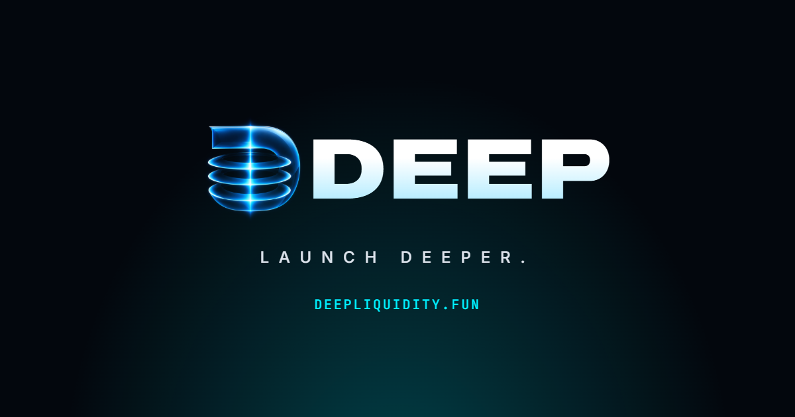

<p align="center">
  <a href="https://deepliquidity.fun"></a>
</p>

<h3 align="center">The Jupiter AMM adapter for DeepSwap, the DEX of the DEEP launchpad on Solana.</h3>

<p align="center">
  <a href="https://deepliquidity.fun"></a>
  <a href="https://github.com/Deep-Liquidity/deep-sdk"></a>
  <a href="https://api.deepliquidity.fun/v1/openapi.json"></a>
  <a href="https://x.com/LaunchOnDL"></a>
  <a href="https://t.me/LaunchOnDL"></a>
</p>

---

# deepswap-jupiter

Jupiter AMM adapter (`jupiter_amm_interface::Amm`) for **DeepSwap**, the constant-product
AMM of the DEEP launchpad. Label: `DeepSwap`.

|                   |                                                                                                 |
| ----------------- | ----------------------------------------------------------------------------------------------- |
| Program           | `deep-amm`, `HCrCy6bzHhZ1b6bXwQAucEFkKXyzYMh3hgAR8UPrYSEP` (mainnet-beta and devnet)            |
| Pool account      | `PoolState` (637 bytes, Anchor discriminator `f7ede3f5d7c3de46`)                                |
| Swap instruction  | `swap_base_input(amount_in: u64, minimum_amount_out: u64)`, discriminator `8fbe5adac41e33de`    |
| Swap modes        | ExactIn only (`supports_exact_out() == false`)                                                  |
| Accounts per swap | 13                                                                                              |

## What DeepSwap is

`deep-amm` is a fork of [Raydium cp-swap](https://github.com/raydium-io/raydium-cp-swap)
(Apache-2.0) at commit `b3187ae5` ("Feat/creator fee share (#80)"). The fork changes:

1. the crate name, and anchor-lang/anchor-spl 1.0.2 -> 1.2.0 (no source changes);
2. `declare_id!` (one DEEP program id for every cluster), the `#[program]` module name
   (`raydium_cp_swap` -> `deep_amm`; **instruction and account discriminators are
   unchanged**), `security_txt!`, and the privileged keys (admin / fee owners), which are
   set at build time;
3. the admin-instruction owner constants, which point at the DEEP admin;
4. clippy lint configuration;
5. `swap_base_output` rejects `amount_out >= output reserve` with `InsufficientVault`
   (upstream panicked there).

For **legacy pools** (`fee_model` = 0) the swap math in `src/curve/{calculator,fees,constant_product}.rs`
is **unmodified** from upstream, and pool and config layouts are byte-compatible with cp-swap.

DEEP then adds its own **V1 fee model** (`fee_model` = 1): a new file `src/curve/v1.rs` with side-dependent fees taken in the pool's
quote token, new `AmmConfig` and `PoolState` fields carved out of upstream's padding (both
account sizes are unchanged, and an account written before V1 reads as legacy), and a V1
branch in the swap handlers. This code is DEEP's, not upstream's.

## How quotes are computed

The adapter does no network I/O. `update()` decodes the raw accounts; `quote()` is
pure integer math (`u128`, checked, no floats) that ports the on-chain code line by line:

| Adapter                                                                                            | Mirrors (in the deep-amm program source)                                               |
| -------------------------------------------------------------------------------------------------- | ------------------------------------------------------------------------------------- |
| `math::ceil_div`, `math::floor_div`                                                                | `curve/fees.rs` `ceil_div`, `floor_div`                                               |
| `math::trading_fee` / `protocol_fee` / `fund_fee` / `creator_fee` / `split_creator_fee`            | `curve/fees.rs` `Fees::*`                                                             |
| `math::swap_base_input_without_fees`                                                               | `curve/constant_product.rs` `ConstantProductCurve::swap_base_input_without_fees`      |
| `math::swap_base_input`                                                                            | `curve/calculator.rs` `CurveCalculator::swap_base_input`                              |
| `state::PoolState::vault_amount_without_fee`                                                       | `states/pool.rs` `PoolState::vault_amount_without_fee`                                |
| `state::PoolState::is_creator_fee_on_input`, `adjust_creator_fee_rate`, `swap_enabled`             | `states/pool.rs` (same names; `get_status_by_bit(Swap)`)                              |
| `DeepSwapAmm::quote_exact_in`                                                                      | `instructions/swap_base_input.rs` `swap_base_input` (all checks before the transfers) |
| `math::total_rate`, `fee_on`, `gross_up`, `split_fee`, `swap_base_input_v1`, `swap_base_output_v1` | `curve/v1.rs` (same names; DEEP V1)                                                   |
| `state::PoolState::swap_fee_model`                                                                 | `instructions/swap_base_input.rs` `swap_fee_model`                                    |
| `state::PoolState::v1_rates`, `state::V1Rates`                                                     | `states/pool.rs` `PoolState::v1_rates`, `V1Rates`                                     |

A pool is quoted with the fee model stored on it: `PoolState.fee_model` (byte 413) must
equal `AmmConfig.fee_model` (byte 124) and be 0 (legacy) or 1 (V1). Anything else makes the
program fail with `FeeModelMismatch`, so the quote errors.

### Legacy pools (`fee_model` = 0)

- **Reserves** = vault balances − (protocol + fund + creator fees accrued on the pool) per token.
- **Creator fee on input** (`creator_fee_on` = 0, or the input side for 1/2):
  `total = ceil(in × (trade + creator) / 1e6)`,
  `creator = floor(total × creator / (trade + creator))`, `trade = total − creator`.
- **Creator fee on output**: `trade = ceil(in × trade / 1e6)`; the creator fee is
  `ceil(swapped × creator / 1e6)`, taken from the curve output.
- The creator rate is forced to 0 unless the pool's `enable_creator_fee` is set. DEEP sets it
  on the pools tokens graduate into (policy: 0.30% on top of the 0.30% trade fee, taken in WSOL
  only, i.e. `creator_fee_on` = the WSOL index); a pool anyone else opens never has it. Both
  rates are read from the `AmmConfig` on every quote, so an admin change is picked up on the
  next `update()`.
- `out = floor((in − input-side fees) × reserve_out / (reserve_in + in − input-side fees))`.
- Protocol and fund fees are floored shares of the trade fee. They stay in the vault and
  only affect later reserves.
- Fees round up and outputs round down, as on chain.

`Quote.fee_amount` is the fee taken from the input (the trade fee, plus the creator fee
when it is charged on the input), in `fee_mint = input_mint`. A creator fee charged on the
output is already deducted from `out_amount`. `fee_pct` is the total rate
(`trade + effective creator`) as a fraction, e.g. `0.003000`.

### V1 pools (`fee_model` = 1): side-dependent fees in the quote token

A V1 pool has a **quote token** (WSOL on a TOKEN/SOL pool), stored in `creator_fee_on`
(1 = token 0, 2 = token 1). A swap whose input is the quote token is a **buy**; the other
direction is a **sell**. Every fee is taken in the quote token, at one total rate per side
(all rates per 1e6):

| part     | rate                                                                | goes to                                                    |
| -------- | ------------------------------------------------------------------- | ---------------------------------------------------------- |
| LP       | `AmmConfig.buy_lp_fee_rate` / `sell_lp_fee_rate`                    | stays in the pool as reserve                               |
| protocol | `AmmConfig.buy_protocol_fee_rate` / `sell_protocol_fee_rate`        | DEEP (`protocol_fees_token_<quote>`)                       |
| reward   | `PoolState.reward_rate_snapshot`, 0 when `reward_model` is Standard | the pool's reward recipient (`creator_fees_token_<quote>`) |

The LP and protocol rates belong to the **config**; the reward rate belongs to the **pool**.

- **Buy** (quote in): `total = ceil(in × T / 1e6)`, `net = in − total`,
  `out = floor(net × reserve_out / (reserve_in + net))`.
- **Sell** (quote out): `gross = floor(in × reserve_out / (reserve_in + in))`,
  `total = ceil(gross × T / 1e6)`, `out = gross − total`.
- **Split**: `lp = floor(total × lp_rate / T)`, `reward = floor(total × reward_rate / T)`,
  `protocol = total − lp − reward`, so the three parts sum to the total exactly.
- **The reward rate belongs to the pool.** It is the token's own rate, chosen by its
  creator and stored in `PoolState.reward_rate_snapshot` when the pool is created
  (`reward_model`: 0 Standard, 1 Creator, 2 Holder; a Standard pool charges no reward
  whatever is stored). No config change can alter it: it is charged in full on every
  swap, on top of the config's LP + protocol rates. `AmmConfig.max_reward_rate` (byte 164)
  is the admin's current maximum for **new** pools only; swaps never read it, and the
  adapter decodes it without using it.
- **Limits**: a side's total `T` is at most 10% (`MAX_TOTAL_FEE_RATE` = 100 000). Within
  that, a pool's reward rate is at most 5% (`MAX_REWARD_RATE` = 50 000) and the config's
  LP + DEEP (protocol) rates are at most 5% together (`MAX_TOTAL_FEE_RATE -
MAX_REWARD_RATE`), so no combination of a pool and a config can exceed 10%. A value above
  its limit cannot be stored; if one is read anyway the program refuses the swap, and the
  quote errors.
- **Reserves** are computed as for legacy pools. The protocol and reward parts are added
  to the quote side's accumulators in both directions, so later reserves exclude them; the
  LP part is not booked and raises the quote reserve.
- The LP and protocol rates are read from the `AmmConfig` on every quote (an admin change
  is picked up on the next `update()`); the legacy rate fields are ignored for V1 pools.

`Quote` for a V1 pool: `fee_amount` is the **whole** fee (LP + protocol + reward) and
`fee_mint` is the quote token, i.e. **the input mint for a buy and the output mint for a
sell**. On a sell the fee is already deducted from `out_amount`. `fee_pct` is that side's
total rate as a fraction, e.g. `0.013500` for a buy and `0.017500` for a sell of a pool
with a 1% reward rate at the current schedule (LP 0.10%; DEEP 0.25% buy, 0.65% sell).
`DeepSwapAmm::quote_exact_in` returns the parts (`lp_fee`, `protocol_fee`, `reward_fee`,
`is_buy`, `total_fee_rate`).

### Errors

A quote **errors** wherever the program would reject the swap: swap status bit set,
`clock.unix_timestamp < open_time`, zero input, zero output, vault smaller than accrued
fees, an empty reserve, invalid `creator_fee_on`, a fee model that differs between the pool
and its config (or is not 0 or 1), V1 LP + protocol rates or a V1 reward rate above their
limit, arithmetic or fee
accumulator overflow, or an unsupported mint. `is_active()` reports the amount-independent
cases: status, `open_time` (read from `AmmContext::clock_ref`), and mint support.

`get_accounts_to_update()` returns the pool, its `AmmConfig`, both vaults, and any
Token-2022 mint.

## Token-2022 stance

SPL Token mints are fully supported. **Token-2022 transfer fees are not modelled.** A
Token-2022 mint is supported only if every extension is one that cannot change the raw
amount moved by `transfer_checked`: `InterestBearingConfig`, `MetadataPointer`,
`TokenMetadata` or `ScaledUiAmount`. A mint with `TransferFeeConfig` (or anything else,
such as a transfer hook or `Pausable`) marks the pool inactive and makes `quote()` return
an error, so the adapter never guesses a fee.

## `Swap::Placeholder` data layout

Jupiter has no `Swap` variant for DeepSwap yet, so the adapter returns
`Swap::Placeholder { data: Some(vec![op, direction]) }`:

| byte | meaning                                                     |
| ---- | ----------------------------------------------------------- |
| 0    | operation: `0` = `swap_base_input` (the only one used)      |
| 1    | direction: `0` = token_0 → token_1, `1` = token_1 → token_0 |

The direction is informational: the program infers it from the vault order in the account
list. The native instruction data is built by the encoder:
`8fbe5adac41e33de ‖ amount_in (u64 LE) ‖ minimum_amount_out (u64 LE)`
(`deepswap_jupiter::encode_swap_base_input`).

`account_metas` are exactly the native `swap_base_input` accounts, in on-chain order:

| #   | account                                                                                          | w   | s   |
| --- | ------------------------------------------------------------------------------------------------ | --- | --- |
| 0   | payer (= `token_transfer_authority`)                                                             |     | ✓   |
| 1   | authority PDA `["vault_and_lp_mint_auth_seed"]` (`9Ed3EyFMgN3q2SbAJPcPNp6aDacgRGF5RyFT7smVSn8o`) |     |     |
| 2   | amm_config                                                                                       |     |     |
| 3   | pool_state                                                                                       | ✓   |     |
| 4   | input_token_account (user source)                                                                | ✓   |     |
| 5   | output_token_account (user destination)                                                          | ✓   |     |
| 6   | input_vault                                                                                      | ✓   |     |
| 7   | output_vault                                                                                     | ✓   |     |
| 8   | input_token_program                                                                              |     |     |
| 9   | output_token_program                                                                             |     |     |
| 10  | input_token_mint                                                                                 |     |     |
| 11  | output_token_mint                                                                                |     |     |
| 12  | observation_state                                                                                | ✓   |     |

## Running the tests

Requires Rust ≥ 1.85. All fixtures are committed, so the tests run offline:

```sh
cargo test --locked                 # unit tests + parity tests
cargo test --locked --lib           # unit tests only (math vectors, decoders, metas)
cargo test --locked --test parity   # parity tests only (LiteSVM + deployed program)
cargo test --locked --test v1_vectors   # V1 math against the cross-language vectors
```

`tests/v1_vectors.rs` reads `tests/fixtures/deepswap-v1-vectors.json`. The same file is
consumed by the on-chain program's tests and by the TypeScript SDK
(`@deepliquidity/curve-math`), so `swap_base_input_v1`, `swap_base_output_v1` and `v1_rates` agree
to the unit in all three.

The **parity tests** use Jupiter's `jupiter-amm-test-kit`. For each swap the kit quotes
with `DeepSwapAmm::quote`, executes the native `swap_base_input` in LiteSVM against the
program binary (`tests/fixtures/deepswap.so`: the release build of deep-amm that is deployed
on mainnet-beta, executable hash
`17e8f45289d6ffda8e1b7b6e948d5c4b97fb1f8a2c748d6431177184300b6052`), and asserts
that the output token delta equals `quote.out_amount` exactly.

- `devnet_wsol_pool`: devnet pool `HxRCxiLSTaT7dsP5DLBH1s8hbGa815Q8JuUhZVmcLw5S`
  (WSOL / `BgDhdvnYVwSDuSZFmbEE8B48ygtEghgq9yoHmtV2DxUY`; 4.95 SOL / 158.4M tokens; 0.30%
  trade fee with 1/3 to the protocol). It runs 8 swaps, 4 in each direction, from dust up
  to several times the input reserve.
- `synthetic_creator_fee_*` (3 tests): the live config has creator fees off and no fund
  fee, so these tests copy the same snapshot into a temp dir and **patch** the pool and
  config bytes there. They set a 1% creator fee in each `creator_fee_on` mode, a 5% fund
  fee, and non-zero accrued protocol/fund/creator fees on both tokens, then run the same
  8 swaps against the same real program. These are synthetic states, not chain data, and
  the committed fixtures are never modified.
- `synthetic_v1_*` (6 tests): the same snapshot patched into a V1
  pool (quote side = token 0 = WSOL) under a V1 config at the current schedule, each with
  its own reward rate: `synthetic_v1_standard_pool` (no reward),
  `synthetic_v1_creator_pool` (1%), `synthetic_v1_holder_pool` (1 bps),
  `synthetic_v1_pool_at_the_reward_ceiling` (5%),
  `synthetic_v1_creator_pool_with_accrued_fees` (1%, accrued fees on both sides) and
  `synthetic_v1_ten_percent_sell_at_the_cap` (LP 0.1% + DEEP 4.9% on sells and a 5% reward
  rate: exactly a 10% sell, with the config's `max_reward_rate` lowered to 1 bps to show
  that it does not affect an existing pool).

The account fixtures are a snapshot of a devnet pool on the legacy fee model; the V1 tests
patch a copy of it. To re-snapshot from chain (this overwrites the account fixtures but keeps
an existing `deepswap.so`; delete that file to re-dump it):

```sh
REFRESH=1 RPC=https://api.devnet.solana.com cargo test --test parity devnet_wsol_pool
```

Do not `cargo update` `solana-clock`, `solana-last-restart-slot` or `solana-slot-history`
past 3.2.0. LiteSVM 0.14 needs wincode 0.5.5, and `Cargo.lock` holds them at 3.1.x.

## Dependencies

- `jupiter-amm-interface` from git, `jup-ag/jupiter-amm-interface@95bd18485e58`. Its
  manifest says 0.6.1, but crates.io's 0.6.1 is the older `anyhow`/`AccountMap` API
  without `Swap::Placeholder`. The dev-dependency `jupiter-amm-test-kit` (not on
  crates.io) is pinned to the same commit, so both resolve to one interface package.
- `solana-account` 4, `solana-pubkey` 4 (`curve25519`, for the authority PDA),
  `solana-instruction` 3.1, `rust_decimal` 1.36, `thiserror` 2.
- Dev only: `serde_json` 1 (reads the V1 vectors), `sha2`, `solana-clock`.

## Status

- The program is deployed on **mainnet-beta** (since 2026-10-08) and on devnet, at the same
  program id. Every mainnet pool uses the V1 fee model.
- Jupiter's on-chain program cannot CPI into a new program id until Jupiter adds a `Swap`
  variant for it. `Swap::Placeholder` exists only for the off-chain test kit. The
  instruction layout is byte-identical to cp-swap (`Swap::RaydiumCP`), but that variant
  targets Raydium's program id.

## License

Apache-2.0 (see `LICENSE`). See `NOTICE`, which credits Raydium cp-swap, whose math and
layouts are ported here, and states which parts (the V1 fee model) are ported from DEEP's
own code instead.

## Links

[Website and app](https://deepliquidity.fun) · [Docs](https://docs.deepliquidity.fun/docs) · [SDK](https://github.com/Deep-Liquidity/deep-sdk) · [Blog](https://blog.deepliquidity.fun) · [Status](https://status.deepliquidity.fun) · [X](https://x.com/LaunchOnDL) · [Telegram](https://t.me/LaunchOnDL)
